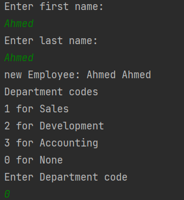
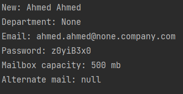
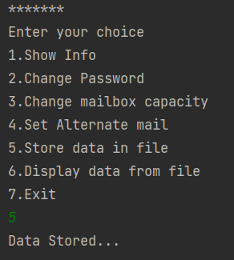
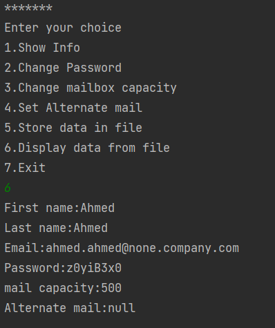

## Email Administration System

#### Project requirements 
```
. Generate an email with the following syntax:
- `firstName.lastName@department.com`
- Determine the department (Sales, development, accounting), if none leave blank.
- Generate a random String for a password.
- Have set methods to change the password, set the mailbox capacity, and define an altrenate email address.
- Have get methods to display the name, email and mailbox capacity.
Have File handling methods to store data into .txt file.
```









***

```java
package emailapp;

import java.io.FileReader;
import java.io.FileWriter;
import java.util.Random;
import java.util.Scanner;

public class Email {
    public Scanner scan = new Scanner(System.in);

    // Setting variable as a private
    private String firstName;
    private String lastName;
    private String dept;
    private String email;
    private String password;
    private String alterEmail;
    private int mailCapacity = 500;

    // Constructor to receive first name, last name
    public Email(String firstName, String lastName) {
        this.firstName = firstName;
        this.lastName = lastName;
        System.out.println("new Employee: " + this.firstName + " " + this.lastName);

        // Calling methods
        this.dept = this.setDept();
        this.password = this.generatePassword(8);
        this.email = this.generateEmail();


    }

    // Generate email method
    private String generateEmail() {
        return this.firstName.toLowerCase() + "." + this.lastName.toLowerCase() + "@" + this.dept.toLowerCase() + ".company.com";
    }

    // Asking for dep
    private String setDept() {
        System.out.println("Department codes \n1 for Sales \n2 for Development \n3 for Accounting \n0 for None");
        boolean flag = false;

        do {
            System.out.println("Enter Department code");
            int choice = scan.nextInt();
            switch (choice) {
                case 1:
                    return "Sales";
                case 2:
                    return "Development";
                case 3:
                    return "Accounting";
                case 0:
                    return "None";
                default:
                    System.out.println("Invalid choice please choose again");
            }
        } while (!flag);
        return null;
    }

    // Generate random password method
    private String generatePassword(int length) {
        Random random = new Random();
        String capitalChars = "ABCDEFGHIJKLMNOPQRSTUVWXYZ";
        String smallChars = "abcdefghijklmnopqrstuvwxyz";
        String numbers = "0123456789";
        String symbols = "!@#$%&?";
        String values = capitalChars + smallChars + numbers + symbols;
        String password = "";

        for (int i = 0; i < length; i++) {
            password = password + values.charAt(random.nextInt(values.length()));

        }
        return password;
    }

    // Change password method
    public void setPassword() {
        boolean flag = false;
        do {
            System.out.println("Do you want to change your password!(Y/N)");
            char choice = scan.next().charAt(0);
            if (choice == 'Y' || choice == 'y') {
                flag = true;
                System.out.println("Enter current password: ");
                String temp = scan.next();
                if (temp.equals(this.password)) {
                    System.out.println("Enter new password: ");
                    this.password = scan.next();
                    System.out.println("Password changed successfully");
                } else {
                    System.out.println("Incorrect password!");
                }

            } else if (choice == 'N' || choice == 'n') {
                flag = true;
                System.out.println("Password changed option cancelled!");
            } else {
                System.out.println("Enter Valid choice!");
            }
        } while (!flag);
    }

    // Set mailbox capacity method
    public void setMailCapacity() {
        System.out.println("Current capacity = " + this.mailCapacity + "mb");
        System.out.println("Enter new mailbox capacity: ");
        this.mailCapacity = scan.nextInt();
        System.out.println("Mailbox capacity successfully changed!");
    }

    // Set alternate
    public void alternateEmail() {
        System.out.println("Enter new alternate mail: ");
        this.alterEmail = scan.next();
        System.out.println("Alternate email is set");
    }

    // Display user information method
    public void getInfo() {
        System.out.println("New: " + this.firstName + " " + this.lastName);
        System.out.println("Department: " + this.dept);
        System.out.println("Email: " + this.email);
        System.out.println("Password: " + this.password);
        System.out.println("Mailbox capacity: " + this.mailCapacity + " mb");
        System.out.println("Alternate mail: " + this.alterEmail);

    }

    // Store in File
    public void storeFile() {
        try {
            FileWriter in = new FileWriter("C:\\Users\\ahmed\\Desktop\\info.txt");
            in.write("First name:" + this.firstName);
            in.append("\nLast name:" + this.lastName);
            in.append("\nEmail:" + this.email);
            in.append("\nPassword:" + this.password);
            in.append("\nmail capacity:" + this.mailCapacity);
            in.append("\nAlternate mail:" + this.alterEmail);
            in.close();
            System.out.println("Data Stored...");

        } catch (Exception e) {
            System.out.println(e);
        }


    }

    // Reading file method
    public void readFile() {
        try {
            FileReader fileReader = new FileReader("C:\\Users\\ahmed\\Desktop\\info.txt");
            int i;
            while ((i = fileReader.read()) != -1) {
                System.out.print((char) i);
            }
            System.out.println();
            fileReader.close();

        } catch (Exception e) {
            System.out.println(e);
        }
    }
}

```

```java
package emailapp;

import java.util.Scanner;

public class EmailApp {
    public static void main(String[] args) {
        // User info
        Scanner scan = new Scanner(System.in);
        System.out.println("Enter first name: ");
        String firstName = scan.next();
        System.out.println("Enter last name: ");
        String lastName = scan.next();

        // Create object for email class
        Email em1 = new Email(firstName, lastName);
        int choice = -1;
        do {
            System.out.println("\n*******\nEnter your choice\n1.Show Info\n2.Change Password\n3.Change mailbox capacity\n4.Set Alternate mail\n5.Store data in file\n6.Display data from file\n7.Exit");
            choice = scan.nextInt();
            switch (choice) {
                case 1:
                    em1.getInfo();
                    break;
                case 2:
                    em1.setPassword();
                    break;
                case 3:
                    em1.setMailCapacity();
                    break;
                case 4:
                    em1.alternateEmail();
                    break;
                case 5:
                    em1.storeFile();
                    break;
                case 6:
                    em1.readFile();
                    break;
                case 7:
                    System.out.println("Thank you for using this application!");
                    break;
                default:
                    System.out.println("Invalid choice!!\nEnter proper choice again.");
            }
        } while (choice !=7);
    }
}

```